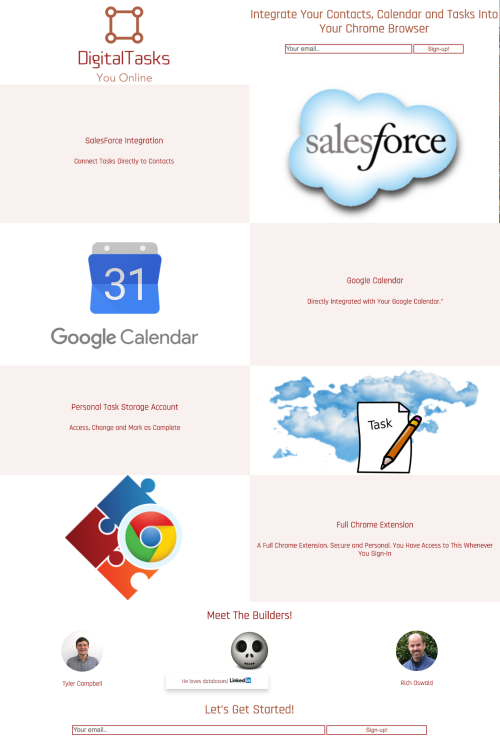
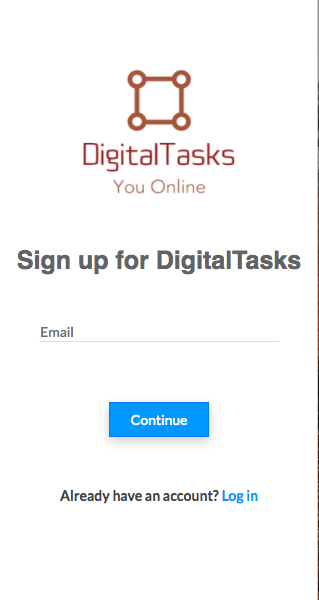
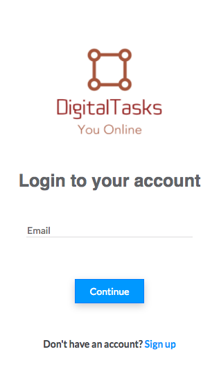
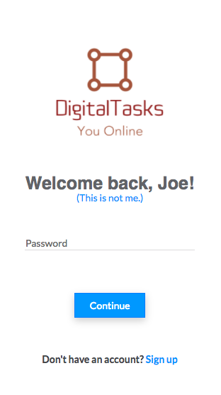
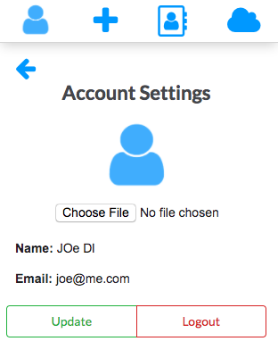
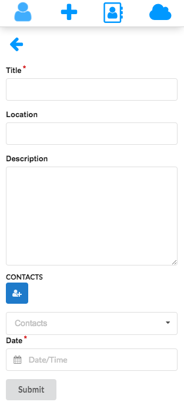
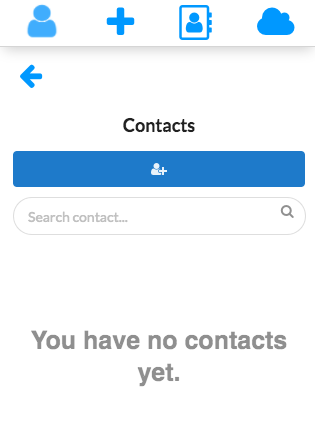
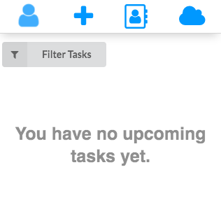

<h1>DigitalTasks Google Chrome Extention version 1.0</h1>
<h4>Coded by Tyler Campbell, Eric Yii and Rich Oswald</h4>
<h4>Released: January 25, 2018</h4>
<h4>To: Public/Chrome Extention Market</h4>
<h2>Origin of Idea</h2>

This app was written as a full-stack project for DigitalCrafts 16-week Full-Stack Immersion Bootcamp. The idea was presented by Tyler Campbell. He shared how his fiance would like a browser extention that would allow her to access her Google Calendar, tasks and contacts as well as SaleForce account data without going to those specific sites.

<h2>Unique Domain Name</h2>
<h3>DigitalTasks.net</h3>

A domain name unique to the app was purchased and used to host the main page and give users a link to sign up for an account.

<h2>Custom Logo</h2>

An app needs a logo for recognition and to have in the upper corner of the browser to launch the extension. A custom logo was designed and purchased to capture the essence of DigitalTasks.

<h2>Static Webpage for Signup and Link to Extention</h2>

 The project involves a static webpage to provide information on the extention and an opportunity to sign-up for an account that links your information. The app itself can retrieve and mark tasks in SalesForce as complete. It also stores tasks and contacts in their app account,

<h2>I-Frame</h2>

The extention is set in an i-frame, so it behaves as a webpage. The forward and back browser buttons function for the extention when it is opened.
<h2>Sign-Up</h2>

Once installed, the user has the ability, directly from the app, to create a user account using a personal email. The user will receive an email verifying their account creation.

<h2>Login</h2>

Once an account is created, the user can go to the sign-in page and login with their email and password.

<h2>Welcome</h2>

After sign-in, the user is directed to a page welcoming them by name.

<h2>Account Settings</h2>

The user has an account setting page where they can add or update their profile picture as well as logout from the app.

<h2>Add A Task</h2>

When adding a task, a title and date is required, while the user can also add a descriptions and particular contacts they would like to associate with the activity.

<h2>Contacts</h2>

The contacts are stored locally. The user can add individuals to their account and then attach them to tasks. A particular contact can be found through the search box. The contact can also be removed.

<h2>Tasks</h2>

All past, current and future tasks can be displayed on the tasks page. Tasks can be filtered for all recorded tasks, completed, overdue and sorted by date using the dropdown menu.

<h2>Challenges</h2>
<ul>
    <li>SSL Certification</li>
    
Providing a secure website address was absolutely essential for trust and to place the app out to the public. Many hours were spent and countless revisions were needed to accomplish this requirement.

    <li>Authentication (Encrypting and Securing User Passwords)</li>
    
 Making sure user information was kept confidential was of utmost importance. Verifying that a user is a real person is the entrance step to connecting to personal information. And allowing the user to create a unique password for access to their account was essential.

    <li>Database Configuration</li>
    
Developing and building a storage location to handle user information (tasks, contacts, dates,id's, etc.) was a great effort. It was necessary to enable CRUD capability so user information could be added, requested, updated and deleted.

</ul>  
<h3>Stretch Goals</h3>

The Minimum Viable Product (MVP) for this project required a massive amount of work.  Research, learning and coding each of the pieces and then integrating them together was a major challenge. But there are several things that we would like to add and/or improve.

<ul>
<li>1.Allow posting of events on Google Calendar.</li>
<li>2.Integrate Google contacts so they are accessable without manual entry.</li>
<li>3.</li>
<li>4.</li>
<li>5.</li>
</ul>

<h3>We want to sincerely thank our instructor, 🏓Chris Aquino 🐱, for his kindness, availability, encouragement, knowledge and wisdom. Without him, this project would not be currently, or probably ever, published.

<h3>👏🏻-Tyler Campbell</h3>
<h3>👏🏻-Eric Yii</h3>
<h3>👏🏻-Rich Oswald</h3>